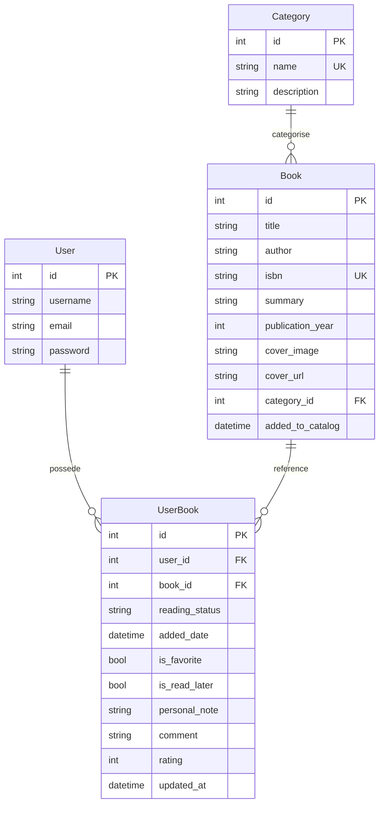
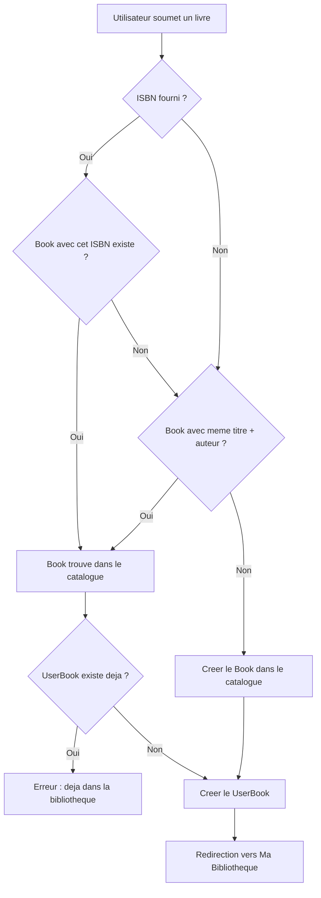
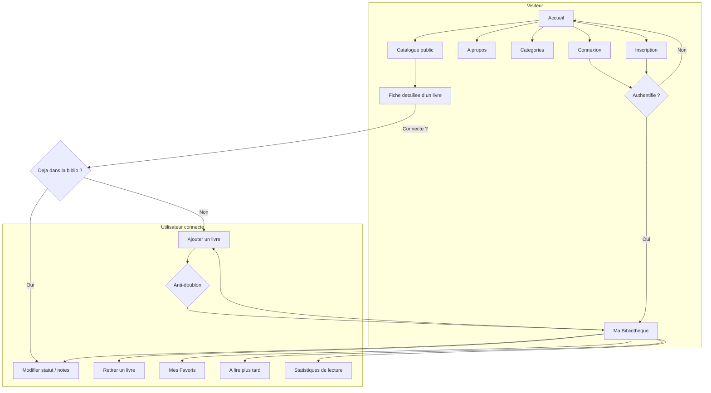
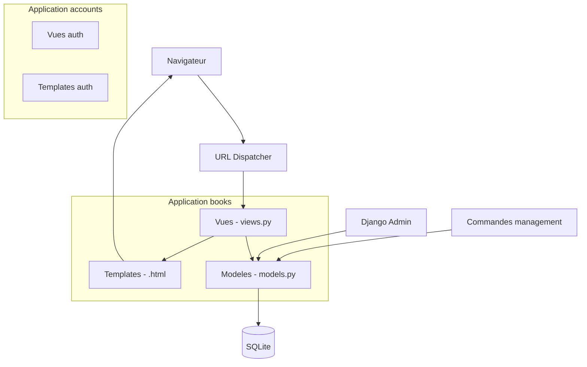
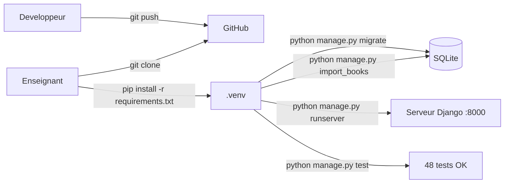
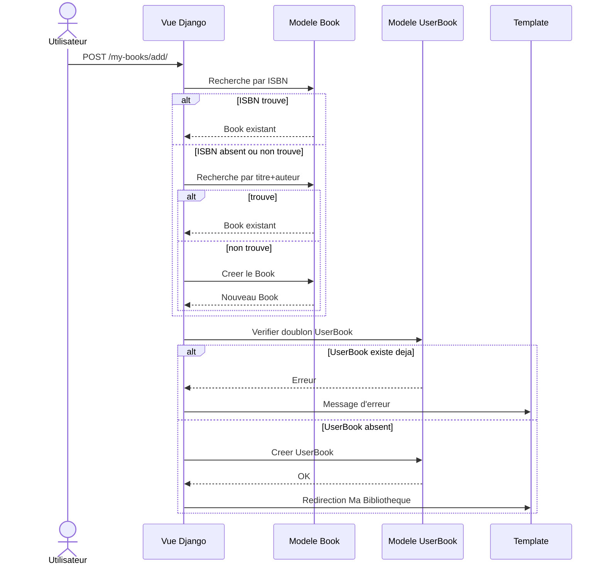
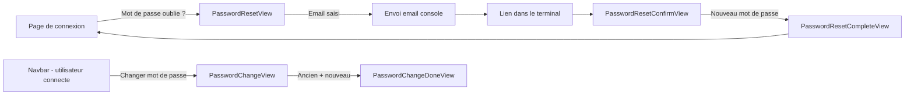
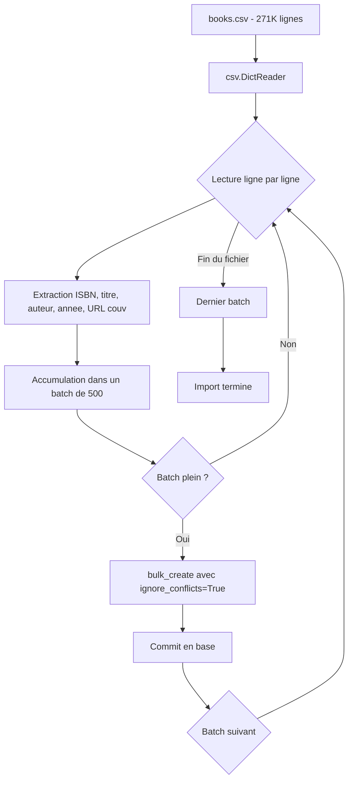

# Diagrammes Mermaid et captures d'écran — BookNest

---

## 1. Diagrammes Mermaid à insérer dans le rapport

> Copier chaque bloc Mermaid dans le rapport Markdown entre ` ```mermaid ` et ` ``` `.

---

### Diagramme 1 — Schéma relationnel (Analyse et conception, §2.4)



**Emplacement :** §2.4 Schéma relationnel

---

### Diagramme 2 — Logique anti-doublon (Analyse et conception, §2.5)



**Emplacement :** §2.5 Logique anti-doublon

---

### Diagramme 3 — Flux utilisateur principal (Analyse et conception, §2.2)



**Emplacement :** §2.2 Cas d'utilisation

---

### Diagramme 4 — Architecture MVT Django (Réalisation technique, §3.1)



**Emplacement :** §3.1 Architecture générale

---

### Diagramme 5 — Déploiement simplifié (Conclusion ou Annexes)



**Emplacement :** Annexes — Instructions d'installation

---

### Diagramme 6 — Parcours CRUD complet (Réalisation technique, §3.6)



**Emplacement :** §3.6 Formulaires, CRUD et anti-doublon

---

### Diagramme 7 — Gestion des mots de passe (Réalisation technique, §3.8)



**Emplacement :** §3.8 Gestion des mots de passe

---

### Diagramme 8 — Import du catalogue (Réalisation technique, §3.9)



**Emplacement :** §3.9 Import du catalogue

---

## 2. Captures d'écran à prendre

> Prendre chaque capture en mode plein écran (`Alt+Impr.Écran`), recadrer proprement, sauvegarder dans `doc/screenshots/`.

| # | Fichier | Page à capturer | URL | Ce qui doit être visible |
|---|---------|-----------------|-----|--------------------------|
| 1 | `01-accueil.png` | **Accueil** | `http://127.0.0.1:8000/` | Les 3 stats (livres, catégories, lecteurs) + « Derniers livres ajoutés » + boutons « Voir tout le catalogue » et « Créer un compte » |
| 2 | `02-catalogue.png` | **Catalogue** | `http://127.0.0.1:8000/catalogue/` | Grille de livres avec couvertures, barre de recherche, filtre catégorie, pagination |
| 3 | `03-livre-detail.png` | **Fiche détaillée** | `http://127.0.0.1:8000/book/1/` | Couverture, titre, auteur, année, ISBN, résumé, note moyenne, catégorie, bouton « Ajouter à ma bibliothèque » |
| 4 | `04-ajout-livre.png` | **Formulaire d'ajout** | `http://127.0.0.1:8000/my-books/add/` | Formulaire rempli avec titre, auteur, catégorie sélectionnée, statut choisi |
| 5 | `05-ma-bibliotheque.png` | **Ma Bibliothèque** | `http://127.0.0.1:8000/my-books/` | Liste des livres personnels avec badges de statut, mini-stats, boutons Modifier/Retirer |
| 6 | `06-favoris.png` | **Favoris** | `http://127.0.0.1:8000/my-books/favorites/` | Page des favoris avec au moins 1 livre marqué favori (cœur) |
| 7 | `07-statistiques.png` | **Statistiques** | `http://127.0.0.1:8000/my-books/stats/` | Barres de progression, répartition par statut et catégorie, taux de complétion |
| 8 | `08-connexion.png` | **Connexion** | `http://127.0.0.1:8000/accounts/login/` | Formulaire de connexion avec lien « Mot de passe oublié ? » visible |
| 9 | `09-reset-password.png` | **Réinitialisation mdp** | `http://127.0.0.1:8000/accounts/password-reset/` | Formulaire de saisie d'email |
| 10 | `10-dropdown-navbar.png` | **Navbar dropdown** | `http://127.0.0.1:8000/` (connecté) | Le menu « Mon Espace » **déplié** montrant toutes les options |
| 11 | `11-admin.png` | **Django Admin** | `http://127.0.0.1:8000/admin/` | Liste des Books avec filtres, ou formulaire d'édition d'un livre |
| 12 | `12-tests.png` | **Tests automatisés** | Terminal | Résultat de `python manage.py test` montrant « Ran 48 tests in ... OK » |

---

## 3. Emplacement des captures dans le rapport Markdown

Dans [`doc/rapport-booknest.md`](doc/rapport-booknest.md), repérer les commentaires `<!-- Insérer capture: ... -->` et les remplacer par :

```markdown

```

Ou pour le DOCX : ouvrir [`rapport-booknest.docx`](rapport-booknest.docx:1) dans Word, et à chaque section indiquée, faire **Insertion > Image**.
