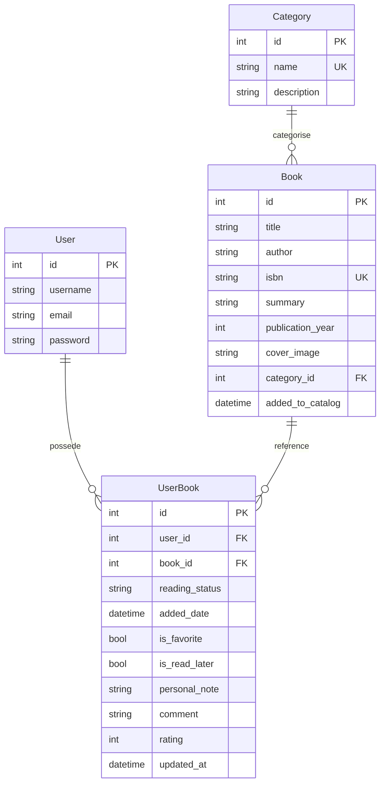
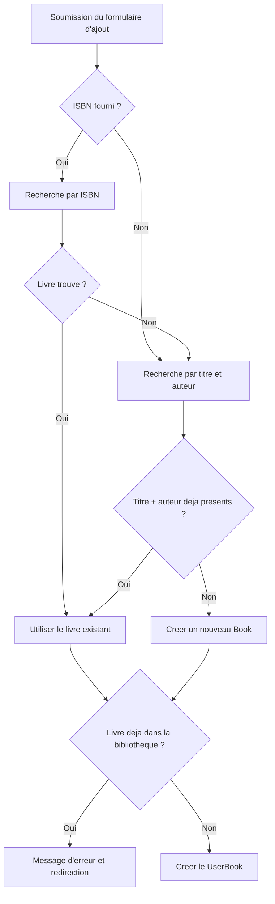

# Rapport de projet Django

# BookNest - Bibliotheque personnelle en ligne

---

## Page de garde

| Element | Information |
|---|---|
| **Titre du projet** | BookNest - Bibliotheque personnelle en ligne |
| **Projet** | Projet numero 2 - Cahier des charges Django 2025-2026 |
| **Etudiant(s)** | [Nom(s) a completer] |
| **Filiere** | [Filiere a completer] |
| **Annee universitaire** | 2025-2026 |
| **Encadrant** | [Nom de l'encadrant a completer] |
| **Lien GitHub** | https://github.com/Tranck04/django-booknest-tracy-franck-mukendi |

---

## Table des matieres

1. Introduction
2. Analyse et conception
3. Realisation technique
4. Tests et validation
5. Conclusion
6. Annexes

---

## 1. Introduction

### 1.1 Contexte

Dans le cadre du cours Django, il a ete demande de realiser une application web complete respectant l'architecture MVT de Django. Le projet devait mettre en oeuvre les notions essentielles du cours : environnement virtuel, applications Django, modeles, migrations, administration, vues, templates, formulaires, authentification, operations CRUD, tests automatises et documentation.

Le projet choisi est **BookNest**, une bibliotheque personnelle en ligne. L'application permet de consulter un catalogue de livres, d'organiser les ouvrages par categories, de gerer une bibliotheque propre a chaque utilisateur et de suivre sa progression de lecture.

### 1.2 Probleme traite

Un lecteur peut rapidement perdre le suivi de ses livres : ouvrages deja lus, livres en cours, livres a lire plus tard, notes personnelles ou avis. Une simple liste ne suffit pas lorsque l'on souhaite aussi classer les livres par categorie, eviter les doublons et conserver des statistiques de lecture.

BookNest repond a ce besoin avec un catalogue commun et des bibliotheques personnelles rattachees aux comptes utilisateurs. Un meme livre n'est stocke qu'une seule fois dans le catalogue, puis il est relie aux utilisateurs qui l'ajoutent a leur collection.

### 1.3 Objectifs du projet

Les objectifs fonctionnels principaux sont les suivants :

- afficher une page d'accueil, une page a propos, un catalogue de livres et une fiche detaillee par ouvrage ;
- permettre l'inscription, la connexion et la deconnexion des utilisateurs ;
- permettre a chaque utilisateur connecte d'ajouter, modifier et retirer des livres de sa bibliotheque ;
- associer les livres a des categories litteraires ;
- indiquer un statut de lecture : a lire, en cours ou termine ;
- administrer les livres, categories et bibliotheques depuis Django Admin ;
- prendre en charge les couvertures de livres, les favoris, la liste a lire plus tard, les notes, commentaires et statistiques.

Les fonctionnalites complementaires demandees dans le cahier des charges ne sont pas traitees comme un module separe : elles sont integrees directement dans les modeles, les vues, les formulaires et les templates de la realisation globale.

### 1.4 Conformite au cahier des charges

| Exigence du cahier des charges | Realisation dans BookNest |
|---|---|
| Catalogue de livres | Vue `BookListView`, template `book_list.html`, recherche et filtre par categorie |
| Fiche detaillee d'un ouvrage | Vue `BookDetailView`, template `book_detail.html`, resume, categorie, avis et note moyenne |
| Ajouter, modifier et supprimer un livre | Parcours CRUD via `UserBookCreateView`, `UserBookUpdateView`, `UserBookDeleteView` |
| Categorie litteraire | Modele `Category`, relation `Book.category`, page des categories et administration |
| Statut de lecture | Champ `reading_status` du modele `UserBook` : a lire, en cours, termine |
| Django Admin | Modeles `Category`, `Book` et `UserBook` administrables |
| Inscription, connexion, deconnexion | Application `accounts`, `SignUpView`, `LoginView`, `LogoutView` |
| Image de couverture | Champ `cover_image`, configuration `MEDIA_URL` / `MEDIA_ROOT`, upload via formulaire |
| Bibliotheque par utilisateur | Modele `UserBook`, relation entre `User` et `Book`, pages privees protegees |
| Favoris et a lire plus tard | Champs `is_favorite`, `is_read_later`, vues et pages dediees |
| Note personnelle et commentaire | Champs `personal_note`, `comment`, `rating`, affichage des avis publics |
| Statistiques | Vue `ReadingStatsView`, repartitions par statut et categorie, taux de completion |
| Tests automatises | 48 tests Django executables avec `python manage.py test` |
| Documentation et GitHub | Rapport, README, requirements.txt, depot GitHub indique en page de garde |

---

## 2. Analyse et conception

### 2.1 Acteurs

| Acteur | Role |
|---|---|
| **Visiteur** | Consulte les pages publiques : accueil, a propos, catalogue, categories et fiches livres. Il peut creer un compte. |
| **Utilisateur connecte** | Gere sa bibliotheque personnelle, ajoute des livres, modifie son statut de lecture, ajoute des notes, marque des favoris et consulte ses statistiques. |
| **Administrateur** | Gere les livres, categories et relations utilisateur depuis l'interface Django Admin. |

### 2.2 Cas d'utilisation principaux

```mermaid
graph TD
    V[Visiteur] --> U1[Consulter le catalogue]
    V --> U2[Voir la fiche d'un livre]
    V --> U3[Consulter les categories]
    V --> U4[S'inscrire]
    V --> U5[Se connecter]

    C[Utilisateur connecte] --> U6[Ajouter un livre a sa bibliotheque]
    C --> U7[Modifier le statut de lecture]
    C --> U8[Ajouter une note ou un commentaire]
    C --> U9[Marquer un livre favori]
    C --> U10[Ajouter a la liste a lire plus tard]
    C --> U11[Retirer un livre de sa bibliotheque]
    C --> U12[Consulter ses statistiques]

    A[Administrateur] --> U13[Administrer livres et categories]
```



### 2.3 Modele de donnees

Le projet utilise trois entites principales : `Category`, `Book` et `UserBook`.

#### Category

| Champ | Type | Role |
|---|---|---|
| `name` | `CharField(100)` | Nom unique de la categorie |
| `description` | `TextField` | Description optionnelle |

#### Book

Le modele `Book` represente le catalogue commun. Un livre n'est pas cree plusieurs fois pour chaque utilisateur : il est stocke une fois, puis reference par les bibliotheques personnelles.

| Champ | Type | Role |
|---|---|---|
| `title` | `CharField(250)` | Titre du livre |
| `author` | `CharField(250)` | Auteur |
| `isbn` | `CharField(13)` | ISBN unique, optionnel |
| `summary` | `TextField` | Resume du livre |
| `publication_year` | `IntegerField` | Annee de publication |
| `cover_image` | `ImageField` | Image de couverture uploadable |
| `category` | `ForeignKey(Category)` | Categorie litteraire |
| `added_to_catalog` | `DateTimeField` | Date d'ajout au catalogue |

La contrainte `unique_together = ('title', 'author')` limite les doublons lorsque l'ISBN n'est pas renseigne.

#### UserBook

Le modele `UserBook` relie un utilisateur a un livre du catalogue et stocke toutes les informations personnelles liees a la lecture.

| Champ | Type | Role |
|---|---|---|
| `user` | `ForeignKey(User)` | Proprietaire de l'entree |
| `book` | `ForeignKey(Book)` | Livre reference dans le catalogue |
| `reading_status` | `CharField` | Statut : a lire, en cours, termine |
| `added_date` | `DateTimeField` | Date d'ajout dans la bibliotheque |
| `is_favorite` | `BooleanField` | Marqueur favori |
| `is_read_later` | `BooleanField` | Marqueur a lire plus tard |
| `personal_note` | `TextField` | Note privee de l'utilisateur |
| `comment` | `TextField` | Commentaire public affiche sur la fiche livre |
| `rating` | `IntegerField` | Evaluation de 1 a 5 |
| `updated_at` | `DateTimeField` | Date de derniere modification |

La contrainte `unique_together = ('user', 'book')` empeche un utilisateur d'ajouter deux fois le meme livre dans sa bibliotheque.

### 2.4 Schema relationnel



### 2.5 Logique anti-doublon



---

## 3. Realisation technique

### 3.1 Architecture generale

Le projet suit l'architecture MVT de Django :

- les **modeles** definissent les donnees et leurs relations ;
- les **vues** traitent les requetes, preparent les donnees et appliquent les regles metier ;
- les **templates** affichent les pages HTML ;
- les **URLs** relient les routes aux vues ;
- Django Admin permet l'administration des donnees.

Arborescence simplifiee :

```text
BookNest/
|-- booknest/                 # Configuration du projet
|   |-- settings.py           # Apps, base SQLite, static, media, auth
|   |-- urls.py               # Routes principales
|-- books/                    # Application principale
|   |-- models.py             # Category, Book, UserBook
|   |-- views.py              # Pages publiques, CRUD, favoris, stats
|   |-- urls.py               # Routes de l'application books
|   |-- admin.py              # Administration des modeles
|   |-- tests.py              # Tests automatises
|-- accounts/                 # Authentification
|   |-- views.py              # SignUpView
|   |-- urls.py               # signup, login, logout
|-- templates/                # Templates HTML
|   |-- base.html
|   |-- books/
|   |-- accounts/
|-- static/css/style.css      # Mise en forme de l'interface
|-- media/book_covers/        # Couvertures uploadables
|-- requirements.txt
|-- manage.py
```

### 3.2 Applications et configuration

Deux applications Django sont utilisees :

| Application | Role |
|---|---|
| `books` | Catalogue, categories, bibliotheque personnelle, CRUD, favoris, commentaires et statistiques |
| `accounts` | Inscription et integration des vues Django de connexion/deconnexion |

Les applications sont declarees dans `INSTALLED_APPS`. Le projet utilise SQLite, les fichiers statiques pour le CSS et les fichiers media pour les couvertures de livres.

Extrait de configuration :

```python
LANGUAGE_CODE = 'fr'
TIME_ZONE = 'Africa/Casablanca'
STATIC_URL = 'static/'
MEDIA_URL = 'media/'
MEDIA_ROOT = BASE_DIR / 'media'
LOGIN_URL = '/accounts/login/'
LOGIN_REDIRECT_URL = '/my-books/'
LOGOUT_REDIRECT_URL = '/'
```

### 3.3 Modeles, migrations et administration

Les modeles `Category`, `Book` et `UserBook` ont ete crees dans l'application `books`. Ils ont fait l'objet de migrations Django afin de creer la structure de la base SQLite.

<!-- CAPTURE: 01-accueil.png — Page d'accueil avec statistiques -->
<!-- CAPTURE: 11-admin.png — Django Admin avec la liste des livres -->

Le modele `Book` inclut l'image de couverture via `ImageField`. Cette fonctionnalite est donc integree directement a la gestion des livres : elle intervient dans le modele, dans le formulaire d'ajout, dans la configuration media et dans les templates de catalogue et de detail.

Le modele `UserBook` permet de separer le catalogue commun de la bibliotheque personnelle. Il contient aussi les informations avancees de suivi de lecture : statut, favori, a lire plus tard, note personnelle, commentaire et evaluation.

Les trois modeles sont administrables depuis Django Admin, ce qui permet a un administrateur de gerer les categories, les livres et les entrees de bibliotheque.

### 3.4 URLs et vues

#### Routes publiques

| Nom | URL | Vue | Role |
|---|---|---|---|
| `home` | `/` | `HomeView` | Accueil et statistiques globales |
| `about` | `/about/` | `AboutView` | Presentation de l'application |
| `catalogue` | `/catalogue/` | `BookListView` | Liste des livres, recherche et filtre |
| `book-detail` | `/book/<pk>/` | `BookDetailView` | Fiche detaillee, avis et note moyenne |
| `category-list` | `/categories/` | `CategoryListView` | Liste des categories |

#### Routes privees

| Nom | URL | Vue | Role |
|---|---|---|---|
| `my-books` | `/my-books/` | `UserBookListView` | Bibliotheque personnelle |
| `userbook-create` | `/my-books/add/` | `UserBookCreateView` | Ajout d'un livre |
| `userbook-update` | `/my-books/<pk>/edit/` | `UserBookUpdateView` | Modification des informations personnelles |
| `userbook-delete` | `/my-books/<pk>/delete/` | `UserBookDeleteView` | Retrait d'un livre |
| `my-favorites` | `/my-books/favorites/` | `UserBookFavoriteListView` | Livres favoris |
| `my-read-later` | `/my-books/read-later/` | `UserBookReadLaterListView` | Liste a lire plus tard |
| `reading-stats` | `/my-books/stats/` | `ReadingStatsView` | Statistiques de lecture |

#### Routes d'authentification

| Nom | URL | Vue |
|---|---|---|
| `accounts:signup` | `/accounts/signup/` | `SignUpView` |
| `accounts:login` | `/accounts/login/` | `LoginView` |
| `accounts:logout` | `/accounts/logout/` | `LogoutView` |

Les vues generiques de Django sont utilisees pour garder un code clair : `TemplateView`, `ListView`, `DetailView`, `CreateView`, `UpdateView` et `DeleteView`.

<!-- CAPTURE: 02-catalogue.png — Catalogue avec recherche et filtres -->
<!-- CAPTURE: 03-livre-detail.png — Fiche détaillée avec note moyenne -->
<!-- CAPTURE: 05-ma-bibliotheque.png — Bibliothèque personnelle -->
<!-- CAPTURE: 06-favoris.png — Page des favoris -->
<!-- CAPTURE: 10-dropdown-navbar.png — Navbar avec dropdown Mon Espace déplié -->

### 3.5 Templates et interface utilisateur

Le projet utilise un template de base `base.html` qui contient la structure commune : navigation, affichage des messages, zone principale et pied de page. Les autres templates heritent de ce fichier et redefinissent les blocs `title` et `content`.

Pages principales :

| Template | Role |
|---|---|
| `books/home.html` | Page d'accueil |
| `books/book_list.html` | Catalogue, filtres et pagination |
| `books/book_detail.html` | Fiche detaillee avec couverture, note moyenne et commentaires |
| `books/userbook_list.html` | Bibliotheque, favoris et a lire plus tard |
| `books/userbook_form.html` | Ajout et modification d'un livre personnel |
| `books/reading_stats.html` | Statistiques de lecture |
| `accounts/login.html` / `accounts/signup.html` | Connexion et inscription |

L'interface est responsive et s'appuie sur `static/css/style.css`. Elle utilise des cartes, badges de statut, filtres, formulaires et barres de progression. Les liens de navigation changent selon l'etat de connexion de l'utilisateur.

Captures a inserer dans la version PDF :

- page d'accueil ;
- catalogue avec filtre par categorie ;
- fiche detaillee d'un livre ;
- formulaire d'ajout ;
- bibliotheque personnelle ;
- page statistiques ;
- resultat des tests.

<!-- CAPTURE: 04-ajout-livre.png — Formulaire d'ajout avec champs remplis -->

### 3.6 Formulaires, CRUD et anti-doublon

L'ajout d'un livre se fait depuis `userbook_form.html`. Lorsqu'un utilisateur ajoute un livre, le formulaire transmet les informations du livre et les informations de lecture. La vue `UserBookCreateView` applique ensuite la logique suivante :

1. recuperer le titre, l'auteur et l'ISBN ;
2. chercher d'abord un livre existant par ISBN ;
3. si aucun livre n'est trouve, chercher par titre et auteur sans tenir compte de la casse ;
4. creer le livre dans le catalogue uniquement s'il n'existe pas encore ;
5. verifier que l'utilisateur n'a pas deja ce livre dans sa bibliotheque ;
6. creer la relation `UserBook`.

La modification permet de mettre a jour le statut, le favori, la liste a lire plus tard, la note personnelle, le commentaire et l'evaluation. La suppression retire uniquement le livre de la bibliotheque personnelle de l'utilisateur ; elle ne supprime pas le livre du catalogue commun.

<!-- CAPTURE: 08-connexion.png — Page de connexion -->
<!-- CAPTURE: 09-reset-password.png — Page de réinitialisation de mot de passe -->

### 3.7 Authentification et securite des donnees

L'authentification repose sur le systeme integre de Django :

- `UserCreationForm` pour l'inscription ;
- `LoginView` pour la connexion ;
- `LogoutView` pour la deconnexion ;
- `LoginRequiredMixin` pour proteger les pages privees.

Les vues de modification et de suppression filtrent le queryset avec `user=self.request.user`. Ainsi, un utilisateur ne peut pas modifier ou supprimer une entree appartenant a un autre compte. Les formulaires utilisent aussi la protection CSRF de Django.

<!-- CAPTURE: 07-statistiques.png — Page des statistiques de lecture -->

### 3.8 Suivi personnel, avis et statistiques

Le suivi de lecture est integre au modele `UserBook`. L'utilisateur peut classer ses livres par statut, marquer un favori, conserver une liste a lire plus tard, ajouter une note personnelle et publier un commentaire.

Les commentaires publics et les evaluations sont exploites dans la fiche detaillee du livre. La note moyenne est calculee avec l'ORM Django :

```python
ratings = UserBook.objects.filter(book=self.object).exclude(rating__isnull=True)
context['avg_rating'] = ratings.aggregate(avg=Avg('rating'))['avg']
context['rating_count'] = ratings.count()
```

La page de statistiques utilise les donnees personnelles de l'utilisateur connecte pour afficher :

- le nombre total de livres ;
- la repartition par statut ;
- la repartition par categorie ;
- les livres favoris ;
- les livres les mieux notes ;
- les derniers ajouts ;
- le taux de completion.

Ces fonctionnalites renforcent le projet sans etre separees du reste : elles prolongent naturellement le modele de bibliotheque personnelle et les parcours utilisateur.

---

<!-- CAPTURE: 12-tests.png — Terminal avec résultat des tests 48/48 OK -->

## 4. Tests et validation

### 4.1 Strategie de test

Les tests automatises sont ecrits avec `django.test.TestCase`. Ils couvrent les modeles, les pages publiques, l'authentification, les operations CRUD, l'isolation des donnees entre utilisateurs, les favoris, la liste a lire plus tard, les statistiques et les evaluations.

Commande d'execution :

```bash
python manage.py test
```

### 4.2 Resultat d'execution

La suite de tests s'execute avec succes :

```text
Found 48 test(s).
System check identified no issues (0 silenced).
................................................
----------------------------------------------------------------------
Ran 48 tests in 58.051s

OK
```

### 4.3 Couverture fonctionnelle des tests

| Categorie | Nombre | Elements verifies |
|---|---:|---|
| Modeles `Category`, `Book`, `UserBook` | 15 | Creation, chaines, contraintes d'unicite, relations et suppressions |
| Pages publiques | 8 | Accueil, a propos, catalogue, filtres, recherche, detail, categories, 404 |
| Authentification | 7 | Inscription, connexion, deconnexion, erreurs de formulaire |
| CRUD utilisateur | 10 | Acces protege, creation, modification, suppression, doublons, isolation |
| Fonctionnalites de suivi | 8 | Favoris, a lire plus tard, statistiques, notes moyennes, couvertures |

### 4.4 Erreurs rencontrees et corrections

| Erreur | Cause | Correction apportee |
|---|---|---|
| `ModuleNotFoundError: No module named 'books'` | Application referencee avant creation effective | Creation des apps puis declaration dans `INSTALLED_APPS` |
| `Cannot use ImageField because Pillow is not installed` | Dependence manquante pour `ImageField` | Installation de Pillow et ajout dans `requirements.txt` |
| `NoReverseMatch` sur certaines routes | Incoherence entre routes namespacees et noms utilises dans les templates | Harmonisation des noms d'URLs et usage de `accounts:login`, `accounts:logout`, `accounts:signup` |
| `TemplateSyntaxError` sur les blocs Django | Balises Django coupees sur plusieurs lignes par le formatage HTML | Correction des templates et desactivation du formatage automatique dans `.vscode/settings.json` |

### 4.5 Points de controle avant remise

| Point de controle | Statut |
|---|---|
| `python manage.py runserver` demarre l'application | A verifier avant soutenance |
| Migrations appliquees | Conforme au projet |
| Superutilisateur et Django Admin disponibles | Conforme au projet |
| CRUD fonctionnel | Verifie par tests |
| `python manage.py test` reussit | 48 tests OK |
| Depot GitHub accessible | Lien indique en page de garde |
| README, requirements.txt et .gitignore presents | Presents dans le depot |
| Rapport PDF et imprime avec captures | A finaliser lors de l'export |

---

## 5. Conclusion

### 5.1 Bilan

BookNest repond au cahier des charges du projet Django. L'application propose les pages publiques attendues, une gestion CRUD, des categories, une authentification complete, une administration Django et une bibliotheque personnelle pour chaque utilisateur.

La realisation va au-dela du socle minimal en integrant directement dans les parcours principaux les couvertures de livres, les favoris, la liste a lire plus tard, les notes, les commentaires, les evaluations et les statistiques de lecture. Ces elements enrichissent l'application sans former une partie separee : ils renforcent les modeles, les vues et les templates existants.

### 5.2 Competences mises en pratique

- creation et configuration d'un projet Django ;
- structuration en applications ;
- modelisation des donnees et relations avec l'ORM ;
- creation de migrations ;
- administration via Django Admin ;
- vues generiques et URL dispatcher ;
- templates avec heritage ;
- formulaires POST et protection CSRF ;
- authentification et protection des vues privees ;
- gestion des fichiers media ;
- tests automatises Django ;
- utilisation de Git et GitHub.

### 5.3 Limites

- l'interface reste simple et pourrait etre enrichie avec un framework CSS ;
- la recherche pourrait devenir plus avancee avec une recherche plein texte ;
- les commentaires ne disposent pas encore d'un systeme de moderation ;
- il n'existe pas encore d'import/export de bibliotheque ;
- l'application n'integre pas encore de recommandations de lecture.

### 5.4 Pistes d'evolution

- ajouter une API REST avec Django REST Framework ;
- permettre l'import/export CSV ou JSON ;
- mettre en place une recherche plein texte ;
- ajouter un systeme de moderation des commentaires ;
- proposer des recommandations basees sur les categories ou les notes ;
- preparer un deploiement en ligne avec une base PostgreSQL.

---

## 6. Annexes

### A. Instructions d'installation

```bash
# 1. Cloner le depot
git clone https://github.com/Tranck04/django-booknest-tracy-franck-mukendi.git
cd django-booknest-tracy-franck-mukendi

# 2. Creer et activer l'environnement virtuel
python -m venv .venv
.venv\Scripts\activate

# 3. Installer les dependances
pip install -r requirements.txt

# 4. Appliquer les migrations
python manage.py migrate

# 5. Creer un superutilisateur
python manage.py createsuperuser

# 6. Lancer le serveur
python manage.py runserver

# 7. Executer les tests
python manage.py test
```

### B. Dependances principales

```text
Django==6.0.6
pillow==12.2.0
```

### C. Depot GitHub

Depot du projet : https://github.com/Tranck04/django-booknest-tracy-franck-mukendi

### D. Liste indicative des commits

| # | Message |
|---:|---|
| 1 | Initialisation du projet Django BookNest |
| 2 | Creation et configuration du projet |
| 3 | Ajout des modeles Category, Book et UserBook |
| 4 | Configuration de Django Admin |
| 5 | Ajout des templates et du CSS |
| 6 | Pages publiques et catalogue |
| 7 | Authentification et bibliotheque personnelle |
| 8 | Couvertures, favoris, notes, commentaires et statistiques |
| 9 | Tests automatises |
| 10 | Documentation et corrections finales |

### E. Captures disponibles ou a ajouter

Le dossier `doc/` contient deja des captures liees a la creation du depot Git et de l'environnement virtuel. Pour le rapport PDF final, il est recommande d'ajouter egalement les captures des pages suivantes : accueil, catalogue, fiche detaillee, formulaire d'ajout, bibliotheque personnelle, statistiques et resultat des tests.