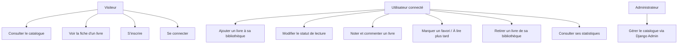
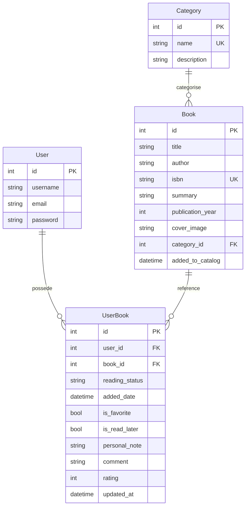
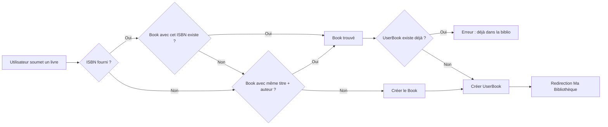

# Rapport de projet Django

# BookNest — Bibliothèque personnelle en ligne

---

## Page de garde

| | |
|---|---|
| **Titre du projet** | BookNest — Bibliothèque personnelle en ligne |
| **Projet** | Projet n°2 — Cahier des charges Django 2025-2026 |
| **Étudiant(s)** | [Nom(s) à compléter] |
| **Filière** | [Filière à compléter] |
| **Année universitaire** | 2025-2026 |
| **Encadrant** | [Nom de l'encadrant à compléter] |
| **Lien GitHub** | https://github.com/Tranck04/django-booknest-tracy-franck-mukendi |

---

## Table des matières

1. Introduction
2. Analyse et conception
   - 2.1 Acteurs
   - 2.2 Cas d'utilisation
   - 2.3 Modèle de données
   - 2.4 Schéma relationnel
3. Réalisation technique
   - 3.1 Architecture Django
   - 3.2 Applications
   - 3.3 URLs et vues
   - 3.4 Modèles
   - 3.5 Templates
   - 3.6 Formulaires
   - 3.7 Authentification
   - 3.8 Anti-doublon
4. Tests et validation
5. Pour aller plus loin
6. Conclusion
7. Annexes

---

## 1. Introduction

### Contexte

Dans le cadre du cours Django, il nous a été demandé de réaliser une application web complète mettant en œuvre les concepts vus en classe : configuration de l'environnement, architecture MVT (Modèle-Vue-Template), modèles de données, administration Django, opérations CRUD, formulaires, authentification utilisateur et tests automatisés.

### Problème traité

La gestion d'une collection de livres personnelle peut rapidement devenir fastidieuse sans outil adapté. Les lecteurs souhaitent pouvoir cataloguer leurs ouvrages, suivre leur progression de lecture, noter leurs impressions et partager leurs avis avec d'autres passionnés. Par ailleurs, la duplication des fiches de livres dans une base de données partagée constitue un gaspillage de ressources.

### Objectifs

BookNest répond à ces besoins en proposant :

- Un **catalogue commun** de livres (titre, auteur, ISBN, résumé, couverture, catégorie) enrichi collaborativement
- Une **bibliothèque personnelle** pour chaque utilisateur (statut de lecture, favoris, notes, commentaires, évaluation)
- Un mécanisme d'**anti-doublon** : si un livre existe déjà dans le catalogue, il est simplement lié à l'utilisateur sans être dupliqué
- Des **statistiques de lecture** personnalisées

### Périmètre fonctionnel

| Fonctionnalité | Description |
|---|---|
| Catalogue commun | Consultation publique de tous les livres avec filtres et recherche |
| Fiche détaillée | Affichage complet d'un livre avec note moyenne et avis |
| Authentification | Inscription, connexion, déconnexion |
| Bibliothèque personnelle | Liste privée des livres de l'utilisateur avec filtres par statut |
| CRUD | Ajout (avec anti-doublon), modification, suppression de livres personnels |
| Favoris & À lire plus tard | Pages dédiées aux livres marqués |
| Statistiques | Répartition par statut, par catégorie, top livres, taux de complétion |
| Administration | Gestion via Django Admin (Category, Book, UserBook) |

---

## 2. Analyse et conception

### 2.1 Acteurs

| Acteur | Rôle |
|---|---|
| **Visiteur** | Consulte le catalogue commun, les fiches livres et les catégories. Peut s'inscrire. |
| **Utilisateur connecté** | Gère sa bibliothèque personnelle (ajout, modification, suppression), ses favoris, consulte ses statistiques. |
| **Administrateur** | Gère le catalogue, les catégories et les relations utilisateur via Django Admin (`/admin/`). |

### 2.2 Cas d'utilisation simplifiés



### 2.3 Modèle de données

#### Entité `Category`

| Champ | Type | Description |
|---|---|---|
| `name` | `CharField(100)` | Nom de la catégorie (unique) |
| `description` | `TextField` | Description optionnelle |

#### Entité `Book` (catalogue commun)

| Champ | Type | Description |
|---|---|---|
| `title` | `CharField(250)` | Titre du livre |
| `author` | `CharField(250)` | Auteur |
| `isbn` | `CharField(13)` | ISBN (unique, optionnel) |
| `summary` | `TextField` | Résumé |
| `publication_year` | `IntegerField` | Année de publication |
| `cover_image` | `ImageField` | Image de couverture (upload) |
| `category` | `ForeignKey(Category)` | Catégorie (SET_NULL) |
| `added_to_catalog` | `DateTimeField` | Date d'ajout au catalogue |

**Contrainte :** `unique_together('title', 'author')` — empêche les doublons.

#### Entité `UserBook` (bibliothèque personnelle)

| Champ | Type | Description |
|---|---|---|
| `user` | `ForeignKey(User)` | Utilisateur propriétaire |
| `book` | `ForeignKey(Book)` | Livre du catalogue |
| `reading_status` | `CharField` | Statut : to_read / reading / finished |
| `added_date` | `DateTimeField` | Date d'ajout à la bibliothèque |
| `is_favorite` | `BooleanField` | Favori |
| `is_read_later` | `BooleanField` | À lire plus tard |
| `personal_note` | `TextField` | Note personnelle |
| `comment` | `TextField` | Commentaire public |
| `rating` | `IntegerField` | Évaluation (1-5) |
| `updated_at` | `DateTimeField` | Dernière modification |

**Contrainte :** `unique_together('user', 'book')` — un utilisateur ne peut pas ajouter deux fois le même livre.

### 2.4 Schéma relationnel



**Logique anti-doublon :**



---

## 3. Réalisation technique

### 3.1 Architecture Django

Le projet suit l'architecture MVT (Modèle-Vue-Template) de Django.

**Arborescence simplifiée :**

```
BookNest/
├── booknest/                # Configuration projet
│   ├── settings.py          # Langue FR, MEDIA, STATIC, LOGIN config
│   └── urls.py              # Routes principales
├── books/                   # Application principale
│   ├── models.py            # Category, Book, UserBook
│   ├── views.py             # 11 vues (publiques + privées + stats)
│   ├── urls.py              # 12 routes
│   ├── admin.py             # 3 modèles enregistrés
│   └── tests.py             # 48 tests
├── accounts/                # Application authentification
│   ├── views.py             # SignUpView
│   └── urls.py              # login, logout, signup
├── templates/               # Templates HTML
│   ├── base.html            # Template de base (navbar, footer)
│   ├── books/               # 11 templates
│   └── accounts/            # 2 templates (login, signup)
├── static/css/style.css     # Feuille de style responsive
├── media/book_covers/       # Images de couverture uploadées
└── manage.py
```

### 3.2 Applications créées

| Application | Rôle |
|---|---|
| `books` | Gestion du catalogue, des catégories, de la bibliothèque personnelle et des statistiques |
| `accounts` | Inscription, connexion et déconnexion des utilisateurs |

Les deux applications sont déclarées dans `INSTALLED_APPS` du fichier `booknest/settings.py`.

### 3.3 URLs et vues

#### URLs de l'application `books`

| Nom | Pattern | Vue | Accès |
|-----|---------|-----|-------|
| `home` | `/` | `HomeView` | Public |
| `about` | `/about/` | `AboutView` | Public |
| `catalogue` | `/catalogue/` | `BookListView` | Public |
| `book-detail` | `/book/<pk>/` | `BookDetailView` | Public |
| `category-list` | `/categories/` | `CategoryListView` | Public |
| `my-books` | `/my-books/` | `UserBookListView` | Connecté |
| `userbook-create` | `/my-books/add/` | `UserBookCreateView` | Connecté |
| `userbook-update` | `/my-books/<pk>/edit/` | `UserBookUpdateView` | Connecté |
| `userbook-delete` | `/my-books/<pk>/delete/` | `UserBookDeleteView` | Connecté |
| `my-favorites` | `/my-books/favorites/` | `UserBookFavoriteListView` | Connecté |
| `my-read-later` | `/my-books/read-later/` | `UserBookReadLaterListView` | Connecté |
| `reading-stats` | `/my-books/stats/` | `ReadingStatsView` | Connecté |

#### URLs de l'application `accounts`

| Nom | Pattern | Vue |
|-----|---------|-----|
| `signup` | `/accounts/signup/` | `SignUpView` |
| `login` | `/accounts/login/` | `LoginView` (auth Django) |
| `logout` | `/accounts/logout/` | `LogoutView` (auth Django) |

#### Vues génériques utilisées

Le projet exploite les vues génériques de Django pour un code concis et maintenable :

| Vue générique | Utilisation |
|---|---|
| `TemplateView` | Accueil, À propos, Statistiques |
| `ListView` | Catalogue, Catégories, Ma Bibliothèque, Favoris, À lire plus tard |
| `DetailView` | Fiche détaillée d'un livre |
| `CreateView` | Ajout de livre, Inscription |
| `UpdateView` | Modification des données personnelles |
| `DeleteView` | Suppression d'un UserBook |
| `LoginView` / `LogoutView` | Authentification (Django built-in) |

### 3.4 Modèles

Les trois modèles sont définis dans `books/models.py`.

**Extrait — Modèle `Book` :**
```python
class Book(models.Model):
    title = models.CharField(max_length=250)
    author = models.CharField(max_length=250)
    isbn = models.CharField(max_length=13, blank=True, null=True, unique=True)
    summary = models.TextField(blank=True)
    publication_year = models.IntegerField(null=True, blank=True)
    cover_image = models.ImageField(upload_to='book_covers/', blank=True, null=True)
    category = models.ForeignKey(Category, on_delete=models.SET_NULL,
                                  null=True, blank=True, related_name='books')
    added_to_catalog = models.DateTimeField(auto_now_add=True)

    class Meta:
        unique_together = ('title', 'author')
```

**Extrait — Modèle `UserBook` :**
```python
class UserBook(models.Model):
    class ReadingStatus(models.TextChoices):
        TO_READ = 'to_read', 'À lire'
        READING = 'reading', 'En cours'
        FINISHED = 'finished', 'Terminé'

    user = models.ForeignKey(User, on_delete=models.CASCADE, related_name='user_books')
    book = models.ForeignKey(Book, on_delete=models.CASCADE, related_name='user_books')
    reading_status = models.CharField(max_length=20, choices=ReadingStatus.choices,
                                       default=ReadingStatus.TO_READ)
    is_favorite = models.BooleanField(default=False)
    is_read_later = models.BooleanField(default=False)
    personal_note = models.TextField(blank=True)
    comment = models.TextField(blank=True)
    rating = models.IntegerField(null=True, blank=True, choices=[(1,'1'),(2,'2'),(3,'3'),(4,'4'),(5,'5')])
    updated_at = models.DateTimeField(auto_now=True)

    class Meta:
        unique_together = ('user', 'book')
```

### 3.5 Templates

L'interface utilise l'héritage de templates. Le fichier `base.html` définit la structure commune :

```html

<!DOCTYPE html>
<html lang="fr">
<head>
    <meta charset="UTF-8">
    <title>BookNest</title>
    <link rel="stylesheet" href="">
</head>
<body>
    <nav class="navbar">
        <!-- Navigation conditionnelle (connecté / non connecté) -->
    </nav>
    <main></main>
    <footer>...</footer>
</body>
</html>
```

**Points clés :**
- La barre de navigation affiche des liens différents selon l'état de connexion (``)
- Les messages Django sont affichés dans un bloc dédié avec classes CSS contextuelles
- Chaque page étend `base.html` et redéfinit les blocs `title` et `content`
- La feuille de style `style.css` (350+ lignes) assure un design responsive avec cartes, badges colorés et barres de progression

**Capture d'écran — Page d'accueil :**
<!-- Insérer capture: templates/books/home.html -->

**Capture d'écran — Catalogue avec filtres :**
<!-- Insérer capture: templates/books/book_list.html -->

**Capture d'écran — Fiche détaillée avec note moyenne :**
<!-- Insérer capture: templates/books/book_detail.html -->

**Capture d'écran — Ma Bibliothèque :**
<!-- Insérer capture: templates/books/userbook_list.html -->

**Capture d'écran — Statistiques de lecture :**
<!-- Insérer capture: templates/books/reading_stats.html -->

### 3.6 Formulaires

Tous les formulaires sont soumis en `POST` avec la protection CSRF (``).

**Formulaire d'ajout de livre (`userbook_form.html`) :**
- Champs texte : titre (obligatoire), auteur (obligatoire), ISBN, résumé, année
- Menu déroulant pour la catégorie
- Upload d'image de couverture (`enctype="multipart/form-data"`)
- Choix du statut de lecture initial

**Formulaire de modification (`userbook_form.html`, mode édition) :**
- Statut de lecture (à lire / en cours / terminé)
- Cases à cocher : Favori, À lire plus tard
- Zones de texte : Note personnelle, Commentaire
- Évaluation : menu déroulant 1 à 5 étoiles

**Formulaires d'authentification :**
- Inscription : `UserCreationForm` de Django
- Connexion : `AuthenticationForm` via `LoginView`

**Capture d'écran — Formulaire d'ajout :**
<!-- Insérer capture: templates/books/userbook_form.html (mode création) -->

### 3.7 Authentification

L'authentification utilise le système intégré de Django :

| Configuration | Valeur |
|---|---|
| `LOGIN_URL` | `/accounts/login/` |
| `LOGIN_REDIRECT_URL` | `/my-books/` |
| `LOGOUT_REDIRECT_URL` | `/` |

**Protection des pages privées :**
- Toutes les vues de la bibliothèque personnelle utilisent `LoginRequiredMixin`
- Les vues `UserBookUpdateView` et `UserBookDeleteView` filtrent le queryset par `user=self.request.user` pour empêcher l'accès aux données d'un autre utilisateur (retourne 404)
- Les boutons d'action (modifier, supprimer) ne sont affichés que si l'utilisateur est connecté

**Capture d'écran — Page de connexion :**
<!-- Insérer capture: templates/accounts/login.html -->

**Capture d'écran — Page d'inscription :**
<!-- Insérer capture: templates/accounts/signup.html -->

### 3.8 Mécanisme anti-doublon

L'anti-doublon est implémenté dans `UserBookCreateView.form_valid()` :

```python
def form_valid(self, form):
    title = self.request.POST.get('title', '').strip()
    author = self.request.POST.get('author', '').strip()
    isbn = self.request.POST.get('isbn', '').strip() or None

    # 1. Recherche par ISBN (identifiant unique)
    book = Book.objects.filter(isbn=isbn).first() if isbn else None

    # 2. Si pas trouvé, recherche par titre + auteur (insensible à la casse)
    if not book:
        book = Book.objects.filter(title__iexact=title, author__iexact=author).first()

    # 3. Si toujours pas trouvé, créer le Book dans le catalogue
    if not book:
        book = Book.objects.create(title=title, author=author, ...)

    # 4. Vérifier que l'utilisateur n'a pas déjà ce livre
    if UserBook.objects.filter(user=self.request.user, book=book).exists():
        messages.error(self.request, "Ce livre est déjà dans votre bibliothèque.")
        return HttpResponseRedirect(reverse_lazy('my-books'))

    # 5. Créer la relation UserBook
    form.instance.user = self.request.user
    form.instance.book = book
    return super().form_valid(form)
```

---

## 4. Tests et validation

### Stratégie de test

Les tests automatisés couvrent l'ensemble du périmètre fonctionnel. Ils sont écrits avec le framework de tests Django (`django.test.TestCase`) et s'exécutent avec la commande :

```bash
python manage.py test books
```

### Résultats

**48 tests exécutés — 48 réussis — 0 échec.**

```
Found 48 test(s).
............................
----------------------------------------------------------------------
Ran 48 tests in 49.254s

OK
Destroying test database...
```

### Détail des tests

| Catégorie | Nombre | Couverture |
|---|---|---|
| Modèle `Category` | 3 | Création, `__str__`, unicité |
| Modèle `Book` | 5 | Création, `__str__`, unicité titre+auteur, unicité ISBN, cascade catégorie |
| Modèle `UserBook` | 7 | Création, `__str__`, défauts, unicité, cascade User/Book, préservation Book |
| Pages publiques | 8 | Accueil, about, catalogue, filtre, recherche, détail, 404, catégories |
| Authentification | 7 | Signup GET/POST succès/échec, login GET/POST succès/échec, logout |
| CRUD UserBook | 10 | Login required, isolation, création nouveau/existant/doublon, champs requis, modification, suppression |
| Phase 11 | 8 | Favoris (page + login), À lire plus tard, Stats (page + login), note moyenne, cover_image |

**Capture d'écran — Résultat des tests :**
<!-- Insérer capture du terminal montrant "Ran 48 tests in ... OK" -->

### Erreurs rencontrées et corrections

| Erreur | Cause | Correction |
|---|---|---|
| `ModuleNotFoundError: No module named 'books'` | Apps déclarées dans `INSTALLED_APPS` avant leur création | Créer les apps avant de les référencer |
| `Cannot use ImageField because Pillow is not installed` | Dépendance manquante | `pip install Pillow` + mise à jour `requirements.txt` |
| `TemplateSyntaxError: Invalid block tag 'endblock'` | Auto-formateur HTML coupant les balises Django sur 2 lignes | Désactiver le formatage automatique HTML dans VSCode (`.vscode/settings.json`) |

---

## 5. Pour aller plus loin

Cinq améliorations ont été implémentées au-delà du périmètre obligatoire :

### 5.1 Image de couverture (11.1)

- Champ `cover_image` (`ImageField`) dans le modèle `Book`
- Upload via le formulaire d'ajout (`enctype="multipart/form-data"`)
- Affichage dans le catalogue (vignettes) et la fiche détaillée (pleine taille)
- Bibliothèque Pillow installée pour le traitement d'images

### 5.2 Anti-doublon avancé (11.2)

- Recherche insensible à la casse (`__iexact`)
- Priorité à l'ISBN (identifiant unique)
- Message informant l'utilisateur si le livre existait déjà
- Blocage si le livre est déjà dans la bibliothèque de l'utilisateur

### 5.3 Pages Favoris et À lire plus tard (11.3)

- Vues dédiées : `UserBookFavoriteListView` et `UserBookReadLaterListView`
- URLs : `/my-books/favorites/` et `/my-books/read-later/`
- Liens dans la barre de navigation
- Réutilisation du template `userbook_list.html` avec titre personnalisé

### 5.4 Notes et commentaires enrichis (11.4)

- Évaluation sur 5 étoiles (menu déroulant)
- Commentaire public visible par tous les utilisateurs
- Note personnelle privée
- Note moyenne calculée via `Avg()` ORM et affichée sur la fiche détaillée

### 5.5 Statistiques de lecture (11.5)

- Page `/my-books/stats/` avec :
  - Répartition par statut (barres de progression CSS)
  - Répartition par catégorie (tableau)
  - Top 3 des livres les mieux notés
  - Derniers ajouts
  - Taux de complétion

**Capture d'écran — Page Statistiques :**
<!-- Insérer capture: templates/books/reading_stats.html -->

---

## 6. Conclusion

### Bilan

Le projet BookNest a permis de mettre en œuvre l'ensemble des compétences attendues dans le cadre du cours Django :

- Création et configuration d'un environnement virtuel Python
- Structuration d'un projet selon l'architecture MVT de Django
- Définition de modèles avec relations (`ForeignKey`, `unique_together`)
- Utilisation des vues génériques (`ListView`, `DetailView`, `CreateView`, `UpdateView`, `DeleteView`, `TemplateView`)
- Mise en place de l'authentification (inscription, connexion, déconnexion, `LoginRequiredMixin`)
- Création de templates avec héritage (`base.html`) et affichage conditionnel
- Gestion des fichiers statiques (CSS) et médias (images de couverture)
- Écriture de tests automatisés complets (48 tests)
- Utilisation de Git et GitHub avec des commits réguliers et significatifs

### Limites

- L'interface est fonctionnelle mais pourrait bénéficier d'un framework CSS (Bootstrap, Tailwind)
- L'anti-doublon avancé (recherche floue avec suggestions) n'a pas été implémenté
- Les évaluations ne sont pas modérées
- Pas de système de recommandation de livres

### Compétences acquises

- Maîtrise de l'ORM Django (requêtes, agrégations, annotations)
- Compréhension du cycle requête/réponse Django
- Gestion des relations Many-to-Many avec attributs via un modèle through (`UserBook`)
- Déploiement d'une logique métier anti-doublon
- Écriture de tests unitaires et d'intégration avec le framework de tests Django

### Pistes d'évolution

- Implémenter une API REST avec Django REST Framework
- Ajouter un système de recommandation basé sur les lectures similaires
- Intégrer une recherche plein texte (PostgreSQL `SearchVector`)
- Permettre l'import/export de bibliothèque (CSV, JSON)
- Ajouter des notifications (livre terminé, nouvel avis)

---

## 7. Annexes

### A. Instructions d'installation

```bash
# 1. Cloner le dépôt
git clone https://github.com/Tranck04/django-booknest-tracy-franck-mukendi.git
cd django-booknest-tracy-franck-mukendi

# 2. Créer et activer l'environnement virtuel
python -m venv .venv
.venv\Scripts\activate      # Windows

# 3. Installer les dépendances
pip install -r requirements.txt

# 4. Appliquer les migrations
python manage.py migrate

# 5. Créer un superutilisateur
python manage.py createsuperuser

# 6. Lancer le serveur
python manage.py runserver
```

### B. Dépendances (`requirements.txt`)

```
Django==6.0.6
Pillow==12.2.0
```

### C. Liste des commits Git

| # | Message |
|---|---------|
| 1 | Initialisation du projet Django BookNest (Phase 0) |
| 2 | Phase 1 - Création et configuration du projet Django BookNest |
| 3 | Phase 2 - Ajout des modèles Category, Book et UserBook avec migrations |
| 4 | Phase 3 - Configuration de Django Admin et peuplement des données de test |
| 5 | Phase 4 - Ajout du template de base et des fichiers statiques CSS |
| 6 | Phases 4-5 - Templates, CSS, pages publiques |
| 7 | Phases 6-7 - Authentification + Bibliothèque personnelle CRUD UserBook avec anti-doublon |
| 8 | Phase 11 - Pour aller plus loin : images couverture, favoris, à lire plus tard, note moyenne, statistiques |
| 9 | Phase 8 - Tests automatisés complets |
| 10 | Phase 9 - README.md complet |
| 11 | Fix - Correction des templates corrompus par l'auto-formateur HTML |
| 12 | Retrait de tous les emojis de l'interface |

### D. Lien du dépôt GitHub

**https://github.com/Tranck04/django-booknest-tracy-franck-mukendi**

### E. Extrait de code — Configuration settings.py

```python
LANGUAGE_CODE = 'fr'
TIME_ZONE = 'Africa/Casablanca'
STATIC_URL = 'static/'
STATICFILES_DIRS = [BASE_DIR / 'static']
MEDIA_URL = 'media/'
MEDIA_ROOT = BASE_DIR / 'media'
LOGIN_URL = '/accounts/login/'
LOGIN_REDIRECT_URL = '/my-books/'
LOGOUT_REDIRECT_URL = '/'
```

---

> **Rapport généré automatiquement à partir du plan de réalisation.**
> **Pensez à :** remplacer les noms des étudiants, ajouter les captures d'écran, exporter en PDF.
