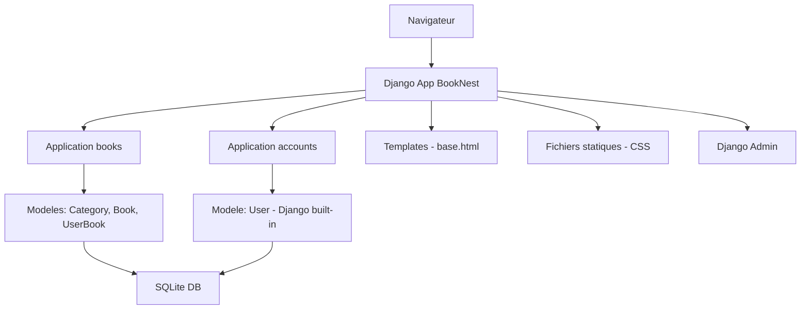
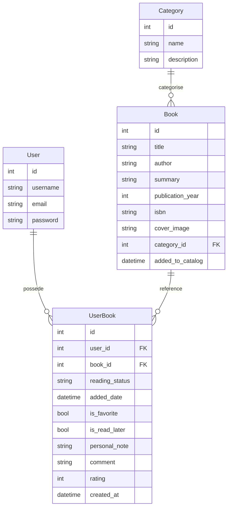
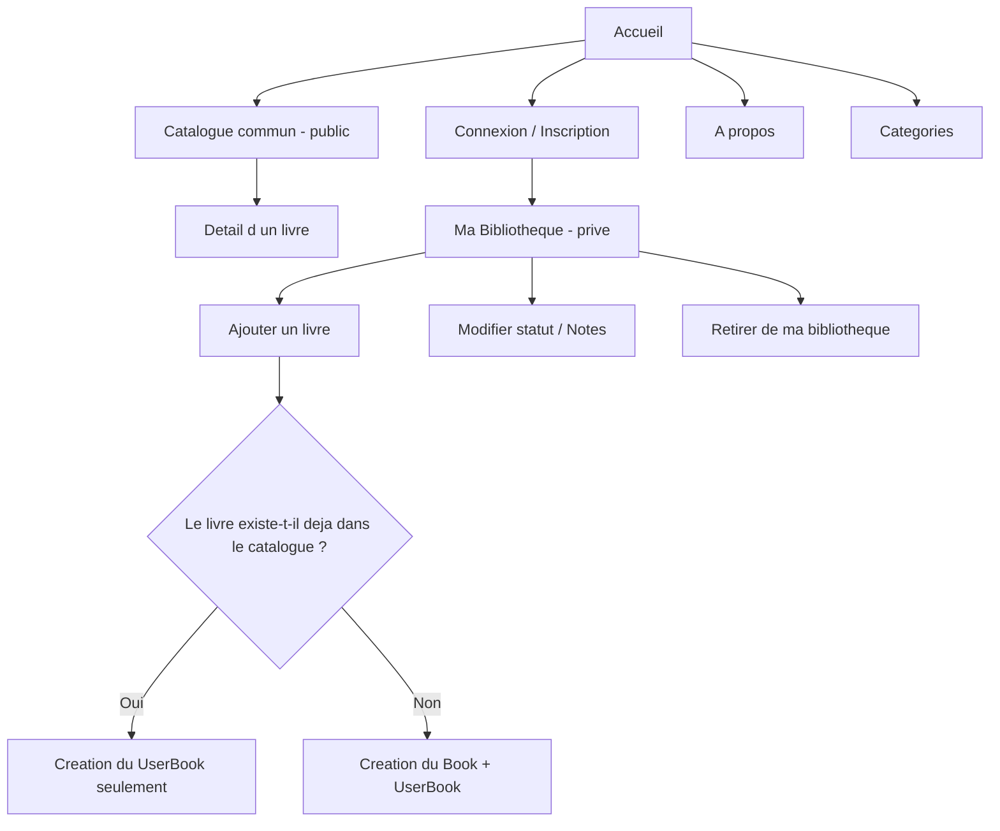
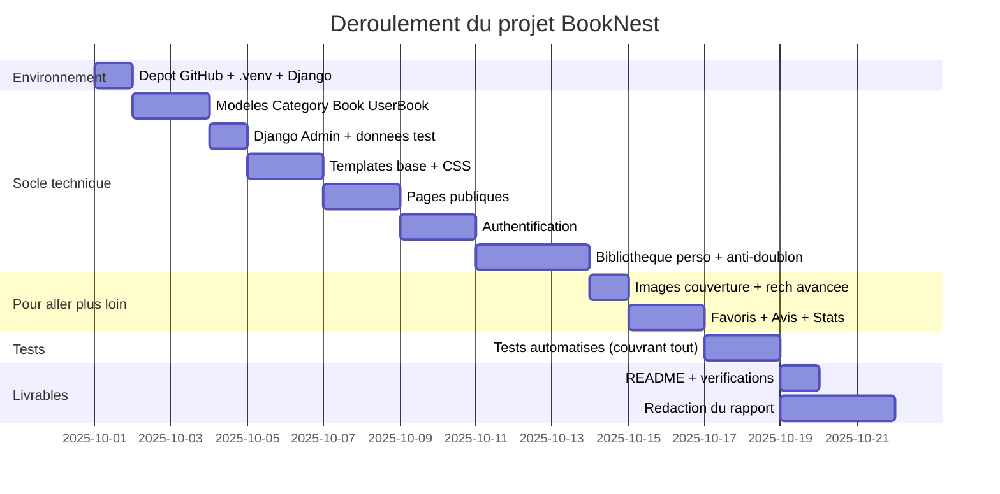

# Plan de réalisation détaillé — BookNest

## Bibliothèque personnelle en ligne (Projet Django n°2)

---

## Vue d'ensemble du projet

**BookNest** est une plateforme web de gestion de bibliothèque personnelle.  
L'application repose sur deux concepts clés :

- **Catalogue commun** : une base centralisée de livres (titre, auteur, résumé, etc.) partagée entre tous les utilisateurs. Un livre n'existe qu'une seule fois dans le catalogue.
- **Bibliothèque personnelle** : chaque utilisateur connecté accède à sa page privée « Ma Bibliothèque » qui liste les livres qu'il a ajoutés. Il peut y suivre son statut de lecture, ajouter des favoris, des notes et des commentaires.

**Mécanisme anti-doublon** : lorsqu'un utilisateur ajoute un livre, le système vérifie si le livre existe déjà dans le catalogue commun (par titre + auteur). Si oui, une simple relation `UserBook` est créée sans dupliquer le livre. Sinon, le livre est d'abord créé dans le catalogue, puis lié à l'utilisateur.

### Architecture cible



### Schema relationnel (nouvelle architecture)



### Flux utilisateur principal



**Logique d'accès :**

- Le **catalogue commun** (liste de tous les `Book`) est accessible à tout visiteur (public)
- Le **détail d'un livre** est public
- La page **« Ma Bibliothèque »** est privée (accessible uniquement après connexion)
- L'**ajout de livre** se fait depuis la page privée, avec vérification anti-doublon
- Le **CRUD utilisateur** s'opère sur `UserBook` (statut, notes, favoris, suppression de la relation), pas directement sur `Book`

---

## Phase 0 — Préparation de l'environnement

### Étape 0.1 — Création du dépôt GitHub

- **Action :** Créer un dépôt nommé `django-booknest-groupe-XX` sur GitHub.
- **Action :** Initialiser avec un `README.md` provisoire.
- **Documentation pour le rapport :** Capture d'écran de la page du dépôt GitHub.

### Étape 0.2 — Mise en place de l'environnement virtuel

- **Action :** Créer un environnement virtuel `.venv` à la racine du projet.
  ```bash
  python -m venv .venv
  ```
- **Action :** Activer l'environnement :
  ```bash
  .venv\Scripts\activate   # Windows
  ```
- **Documentation :** Capture de l'activation + version Python (`python --version`).

### Étape 0.3 — Installation de Django et dépendances

- **Action :** Installer Django dans le `.venv`.
  ```bash
  pip install django
  ```
- **Action :** Générer le fichier `requirements.txt`.
  ```bash
  pip freeze > requirements.txt
  ```
- **Documentation :** Contenu du `requirements.txt` commenté.

### Étape 0.4 — Création du fichier `.gitignore`

- **Action :** Créer `.gitignore` adapté à Django/Python (exclure `.venv`, `__pycache__`, `*.pyc`, `db.sqlite3`, `media/`, fichiers sensibles, etc.).
- **Documentation :** Contenu du `.gitignore` dans le rapport.

---

## Phase 1 — Création et configuration du projet Django

### Étape 1.1 — Création du projet

- **Action :** `django-admin startproject booknest .`
- **Action :** Vérifier la structure créée (`manage.py`, `booknest/settings.py`, `booknest/urls.py`, etc.).
- **Documentation :** Arborescence du projet après création.

### Étape 1.2 — Configuration de `settings.py`

- **Action :** Configurer :
  - `LANGUAGE_CODE = 'fr'` (français)
  - `TIME_ZONE = 'Africa/Casablanca'`
  - `STATIC_URL` et `STATICFILES_DIRS` pour les fichiers CSS/JS personnalisés.
  - `MEDIA_URL = '/media/'` et `MEDIA_ROOT = BASE_DIR / 'media'` (anticipation pour les images de couverture).
  - Ajouter `'books.apps.BooksConfig'` et `'accounts.apps.AccountsConfig'` dans `INSTALLED_APPS` (anticipation).
  - Configurer `LOGIN_URL = '/accounts/login/'`, `LOGIN_REDIRECT_URL = '/'`, `LOGOUT_REDIRECT_URL = '/'`.
- **Documentation :** Extraits commentés de `settings.py`.

### Étape 1.3 — Première migration et superutilisateur

- **Action :** `python manage.py migrate`
- **Action :** `python manage.py createsuperuser`
- **Action :** Vérifier que `python manage.py runserver` démarre sans erreur.
- **Documentation :** Capture du serveur en marche + page d'accueil Django par défaut.

### Étape 1.4 — Premier commit Git

- **Action :** `git init` (si pas déjà fait), `git add .`, `git commit -m "Initialisation du projet Django BookNest"`
- **Action :** Lier au dépôt distant et pousser.
- **Documentation :** Capture du log Git après push.

---

## Phase 2 — Application « books » : modèles de données

### Étape 2.1 — Création de l'application `books`

- **Action :** `python manage.py startapp books`
- **Action :** Ajouter `'books.apps.BooksConfig'` dans `INSTALLED_APPS`.
- **Documentation :** Arborescence de l'application `books/`.

### Étape 2.2 — Définition du modèle `Category`

- **Fichier :** `books/models.py`
- **Champs :**
  - `name` : `CharField(max_length=100, unique=True)` — nom de la catégorie
  - `description` : `TextField(blank=True)` — description optionnelle
- **Méthodes :** `__str__()` retourne le nom.
- **Documentation :** Code du modèle + explication des choix de types de champs.

### Étape 2.3 — Définition du modèle `Book` (catalogue commun)

- **Fichier :** `books/models.py`
- **Champs :**
  - `title` : `CharField(max_length=250)` — titre du livre
  - `author` : `CharField(max_length=250)` — auteur
  - `isbn` : `CharField(max_length=13, blank=True, null=True, unique=True)` — ISBN (identifiant unique, facilite la déduplication)
  - `summary` : `TextField(blank=True)` — résumé
  - `publication_year` : `IntegerField(null=True, blank=True)` — année de publication
  - `cover_image` : `ImageField(upload_to='book_covers/', blank=True, null=True)` — image de couverture (anticipation « Pour aller plus loin »)
  - `category` : `ForeignKey(Category, on_delete=models.SET_NULL, null=True, blank=True, related_name='books')` — catégorie associée
  - `added_to_catalog` : `DateTimeField(auto_now_add=True)` — date d'ajout au catalogue
- **Contrainte :** `unique_together = ('title', 'author')` — empêche les doublons exacts dans le catalogue commun
- **Méthodes :** `__str__()` retourne le titre.
- **Documentation :** Code du modèle + schéma relationnel.

### Étape 2.4 — Définition du modèle `UserBook` (bibliothèque personnelle)

> C'est le cœur de l'architecture : il relie un utilisateur à un livre du catalogue avec ses données personnelles.

- **Fichier :** `books/models.py`
- **Champs :**
  - `user` : `ForeignKey(User, on_delete=models.CASCADE, related_name='user_books')` — utilisateur propriétaire
  - `book` : `ForeignKey(Book, on_delete=models.CASCADE, related_name='user_books')` — livre du catalogue
  - `reading_status` : `CharField(max_length=20, choices=[('to_read','À lire'), ('reading','En cours'), ('finished','Terminé')], default='to_read')` — statut de lecture
  - `added_date` : `DateTimeField(auto_now_add=True)` — date d'ajout à la bibliothèque perso
  - `is_favorite` : `BooleanField(default=False)` — livre favori
  - `is_read_later` : `BooleanField(default=False)` — à lire plus tard
  - `personal_note` : `TextField(blank=True)` — note personnelle
  - `comment` : `TextField(blank=True)` — commentaire/avis
  - `rating` : `IntegerField(null=True, blank=True, choices=[(1,'1 étoile'),(2,'2 étoiles'),(3,'3 étoiles'),(4,'4 étoiles'),(5,'5 étoiles')])` — évaluation
  - `updated_at` : `DateTimeField(auto_now=True)` — dernière modification
- **Contrainte :** `unique_together = ('user', 'book')` — un utilisateur ne peut pas ajouter deux fois le même livre
- **Méthodes :** `__str__()` retourne `f"{user.username} - {book.title}"`.
- **Documentation :** Code complet du modèle, explication du choix de conception (table de liaison avec attributs).

### Étape 2.5 — Création et application des migrations

- **Action :** `python manage.py makemigrations books`
- **Action :** `python manage.py migrate`
- **Documentation :** Capture des migrations créées + résultat de `python manage.py showmigrations`.

### Étape 2.6 — Commit Git

- **Action :** Commit avec message « Ajout des modèles Category, Book et UserBook avec migrations ».

---

## Phase 3 — Django Admin

### Étape 3.1 — Enregistrement des modèles dans l'admin

- **Fichier :** `books/admin.py`
- **Action :** `admin.site.register(Category)` — avec `list_display = ('name', 'description')` et `search_fields = ('name',)`
- **Action :** `admin.site.register(Book)` — avec `list_display = ('title', 'author', 'isbn', 'category', 'added_to_catalog')`, `list_filter = ('category',)`, `search_fields = ('title', 'author', 'isbn')`
- **Action :** `admin.site.register(UserBook)` — avec `list_display = ('user', 'book', 'reading_status', 'is_favorite', 'added_date')`, `list_filter = ('reading_status', 'is_favorite')`, `search_fields = ('user__username', 'book__title')`
- **Documentation :** Code d'administration + captures de l'interface admin pour chaque modèle.

### Étape 3.2 — Peuplement de données de test via l'admin

- **Action :** Créer 4-5 catégories (Roman, Science-Fiction, Biographie, Histoire, Poésie).
- **Action :** Créer 8-10 livres dans le catalogue commun via l'admin.
- **Action :** Créer quelques `UserBook` pour tester les relations (associer des livres à des utilisateurs).
- **Documentation :** Captures de l'admin avec données.

### Étape 3.3 — Commit Git

- **Action :** Commit avec message « Configuration de Django Admin pour Category, Book et UserBook ».

---

## Phase 4 — Templates et fichiers statiques

### Étape 4.1 — Création du template de base `base.html`

- **Fichier :** `templates/base.html`
- **Contenu :**
  - Structure HTML5 complète
  - Blocs Django : ``, ``, ``
  - Barre de navigation avec :
    - Liens publics : Accueil, Catalogue, Catégories, À propos
    - Liens conditionnels : si connecté → « Ma Bibliothèque », « Déconnexion » ; si non connecté → « Connexion », « Inscription »
  - Affichage conditionnel : ``
  - Inclusion du CSS (``)
  - Bloc pour les messages Django (`django.contrib.messages`) avec classes CSS pour succès, erreur, info
  - Pied de page
- **Action :** Configurer `TEMPLATES['DIRS']` dans `settings.py` pour inclure le dossier `templates/` racine.
- **Documentation :** Code complet de `base.html` commenté, capture du rendu.

### Étape 4.2 — Création de la feuille de style CSS

- **Fichier :** `static/css/style.css`
- **Contenu :**
  - Style responsive (mobile-first)
  - Palette de couleurs : tons bleus/verts évoquant une bibliothèque
  - Typographie : police lisible (system font stack)
  - Classes pour badges de statut (à lire = orange, en cours = bleu, terminé = vert)
  - Classes pour boutons, cartes de livres, grille responsive
  - Style de la navigation
  - Messages flash stylisés
- **Documentation :** Extrait du CSS avec aperçu du rendu.

### Étape 4.3 — Commit Git

- **Action :** Commit avec message « Ajout du template de base et des fichiers statiques CSS ».

---

## Phase 5 — Pages publiques (vues + templates)

### Étape 5.1 — Page d'accueil

- **URL :** `/` → nommée `home`
- **Vue :** `TemplateView` (`books/views.py`)
- **Template :** `books/home.html`
  - Présentation de BookNest
  - Compteurs : nombre total de livres dans le catalogue, nombre de catégories, nombre d'utilisateurs inscrits
  - Si connecté : lien vers « Ma Bibliothèque »
  - Si non connecté : incitation à s'inscrire
  - Derniers livres ajoutés au catalogue (5 derniers)
- **Documentation :** Code vue + template + capture.

### Étape 5.2 — Page « À propos »

- **URL :** `/about/` → nommée `about`
- **Vue :** `TemplateView`
- **Template :** `books/about.html`
  - Description du projet BookNest
  - Technologies utilisées (Python, Django, SQLite, HTML, CSS)
  - Fonctionnalités
  - Auteurs du projet
- **Documentation :** Code + capture.

### Étape 5.3 — Page catalogue commun

- **URL :** `/catalogue/` → nommée `catalogue`
- **Vue :** `ListView` sur le modèle `Book`
  - Tri par `title` ou `added_to_catalog` (configurable)
  - Pagination (12 livres par page)
- **Template :** `books/book_list.html`
  - Grille de cartes avec : image de couverture (si disponible), titre, auteur, catégorie
  - Lien vers la fiche détaillée
  - Barre de filtre par catégorie (query string `?category=X`) et par recherche textuelle (`?q=...`)
  - Indication du nombre de résultats
- **Accessibilité :** Public (aucune restriction)
- **Documentation :** Code vue + template + captures (catalogue, filtre, recherche).

### Étape 5.4 — Page détail d'un livre

- **URL :** `/book/<int:pk>/` → nommée `book-detail`
- **Vue :** `DetailView` sur `Book`
  - Contexte supplémentaire : si l'utilisateur est connecté, vérifier s'il a déjà ce livre dans sa bibliothèque (`UserBook` existe ?)
- **Template :** `books/book_detail.html`
  - Affichage complet : image de couverture, titre, auteur, ISBN, résumé, année, catégorie, date d'ajout au catalogue
  - Si connecté et livre déjà dans sa bibliothèque : badge « Dans ma bibliothèque », possibilité de modifier le statut
  - Si connecté et livre non présent : bouton « Ajouter à ma bibliothèque »
  - Si non connecté : message « Connectez-vous pour ajouter ce livre à votre bibliothèque »
- **Documentation :** Code + captures (livre avec/sans image, connecté/non connecté).

### Étape 5.5 — Page des catégories

- **URL :** `/categories/` → nommée `category-list`
- **Vue :** `ListView` sur `Category` avec annotation `Count('books')`
- **Template :** `books/category_list.html`
  - Liste des catégories avec nombre de livres par catégorie
  - Lien vers le catalogue filtré par catégorie
- **Documentation :** Code + capture.

### Étape 5.6 — Configuration des URLs de l'application `books`

- **Fichier :** `books/urls.py` + inclusion dans `booknest/urls.py`
- **Tableau des URLs :**

| Nom             | Pattern           | Vue                | Description          |
| --------------- | ----------------- | ------------------ | -------------------- |
| `home`          | `/`               | `TemplateView`     | Page d'accueil       |
| `about`         | `/about/`         | `TemplateView`     | À propos             |
| `catalogue`     | `/catalogue/`     | `BookListView`     | Catalogue commun     |
| `book-detail`   | `/book/<int:pk>/` | `BookDetailView`   | Fiche détaillée      |
| `category-list` | `/categories/`    | `CategoryListView` | Liste des catégories |

- **Documentation :** Tableau des URLs + code d'inclusion.

### Étape 5.7 — Commit Git

- **Action :** Commit avec message « Ajout des pages publiques : accueil, à propos, catalogue, détail livre, catégories ».

---

## Phase 6 — Authentification (application `accounts`)

### Étape 6.1 — Création de l'application `accounts`

- **Action :** `python manage.py startapp accounts`
- **Action :** Ajouter `'accounts.apps.AccountsConfig'` dans `INSTALLED_APPS`.
- **Documentation :** Arborescence de l'application.

### Étape 6.2 — Page d'inscription

- **URL :** `/accounts/signup/` → nommée `signup`
- **Vue :** `CreateView` avec `UserCreationForm` personnalisé (ajout du champ email)
- **Template :** `accounts/signup.html`
- **Redirection :** vers la page de connexion avec message de succès après inscription.
- **Documentation :** Code formulaire, vue, template + capture.

### Étape 6.3 — Page de connexion

- **URL :** `/accounts/login/` → nommée `login`
- **Vue :** `LoginView` de Django (`django.contrib.auth.views.LoginView`)
- **Template :** `accounts/login.html`
- **Redirection :** vers « Ma Bibliothèque » après connexion (`LOGIN_REDIRECT_URL = '/my-books/'`).
- **Documentation :** Code + capture.

### Étape 6.4 — Déconnexion

- **URL :** `/accounts/logout/` → nommée `logout`
- **Vue :** `LogoutView` de Django
- **Redirection :** vers l'accueil.
- **Documentation :** Code.

### Étape 6.5 — Configuration des URLs d'authentification

- **Fichier :** `accounts/urls.py` + inclusion dans `booknest/urls.py`
- **Documentation :** Tableau des URLs auth.

### Étape 6.6 — Commit Git

- **Action :** Commit avec message « Mise en place de l'authentification : inscription, connexion, déconnexion ».

---

## Phase 7 — Bibliothèque personnelle et CRUD (UserBook)

### Étape 7.1 — Page « Ma Bibliothèque »

- **URL :** `/my-books/` → nommée `my-books`
- **Vue :** `ListView` sur `UserBook` filtré par `request.user`
  - `UserBook.objects.filter(user=request.user).select_related('book', 'book__category')`
  - Tri : par date d'ajout (défaut), titre, statut
  - Pagination : 12 par page
  - Filtres : par statut de lecture (`?status=reading`), favoris (`?favorite=1`), à lire plus tard (`?read_later=1`)
- **Template :** `books/userbook_list.html`
  - Grille de cartes personnelles : image couverture, titre, auteur, statut (badge coloré), favori (cœur), note
  - Liens : modifier statut, voir détail, retirer de la bibliothèque
  - Bouton « Ajouter un livre »
  - Zone de stats rapides : X livres, Y en cours, Z terminés, W favoris
- **Protection :** `LoginRequiredMixin`
- **Documentation :** Code vue + template + captures.

### Étape 7.2 — Page « Ajouter un livre à ma bibliothèque » (avec anti-doublon)

- **URL :** `/my-books/add/` → nommée `userbook-create`
- **Vue :** Vue personnalisée (fonctionnelle ou `CreateView` surchargée)
- **Logique métier (anti-doublon) :**
  1. L'utilisateur remplit un formulaire avec : titre, auteur, ISBN (optionnel), catégorie, statut de lecture initial
  2. À la soumission, le système vérifie si un `Book` existe déjà dans le catalogue avec le même couple (titre, auteur) OU le même ISBN
  3. **Si le livre existe déjà :**
     - Vérifier si l'utilisateur a déjà un `UserBook` pour ce livre → si oui, message d'erreur « Ce livre est déjà dans votre bibliothèque »
     - Sinon, créer le `UserBook` liant l'utilisateur au `Book` existant
  4. **Si le livre n'existe pas :**
     - Créer le `Book` dans le catalogue commun
     - Créer le `UserBook` liant l'utilisateur au nouveau `Book`
  5. Message de succès : « Livre ajouté à votre bibliothèque » (avec précision « Nouveau livre ajouté au catalogue » ou « Livre existant ajouté à votre bibliothèque »)
  6. Redirection vers « Ma Bibliothèque »
- **Template :** `books/userbook_form.html`
  - Formulaire avec les champs Book + le statut initial
  - ``
- **Protection :** `LoginRequiredMixin`
- **Documentation :** Algorithme d'anti-doublon (diagramme), code de la vue, captures (cas doublon, cas nouveau livre).

### Étape 7.3 — Modification du statut et des données personnelles

- **URL :** `/my-books/<int:pk>/edit/` → nommée `userbook-update`
- **Vue :** `UpdateView` sur `UserBook`
  - Vérification que le `UserBook` appartient bien à `request.user` (sinon 403)
- **Champs modifiables :** `reading_status`, `is_favorite`, `is_read_later`, `personal_note`, `comment`, `rating`
- **Template :** `books/userbook_form.html` (ou template dédié `userbook_edit.html`)
- **Protection :** `LoginRequiredMixin` + vérification propriétaire
- **Documentation :** Code + captures (avant/après modification).

### Étape 7.4 — Retirer un livre de sa bibliothèque

- **URL :** `/my-books/<int:pk>/delete/` → nommée `userbook-delete`
- **Vue :** `DeleteView` sur `UserBook`
  - Vérification que le `UserBook` appartient à `request.user`
  - **Important :** la suppression du `UserBook` ne supprime PAS le `Book` du catalogue commun
- **Template :** `books/userbook_confirm_delete.html` — message de confirmation
- **Redirection :** vers « Ma Bibliothèque » avec message de succès
- **Protection :** `LoginRequiredMixin` + vérification propriétaire
- **Documentation :** Code + capture de la page de confirmation.

### Étape 7.5 — Messages de succès/erreur

- **Action :** Utiliser `messages.success()`, `messages.error()`, `messages.warning()` après chaque opération.
- **Action :** Messages dans `base.html` avec classes CSS dédiées.
- **Documentation :** Captures des messages utilisateur.

### Étape 7.6 — Configuration des URLs de la bibliothèque

- **Fichier :** `books/urls.py` — ajout des routes `my-books/`

| Nom               | Pattern                      | Vue                  | Description                |
| ----------------- | ---------------------------- | -------------------- | -------------------------- |
| `my-books`        | `/my-books/`                 | `UserBookListView`   | Ma bibliothèque            |
| `userbook-create` | `/my-books/add/`             | `UserBookCreateView` | Ajouter un livre           |
| `userbook-update` | `/my-books/<int:pk>/edit/`   | `UserBookUpdateView` | Modifier statut/notes      |
| `userbook-delete` | `/my-books/<int:pk>/delete/` | `UserBookDeleteView` | Retirer de la bibliothèque |

### Étape 7.7 — Commit Git

- **Action :** Commit avec message « Implémentation de la bibliothèque personnelle avec anti-doublon et CRUD UserBook ».

---

## Phase 8 — Tests automatisés

### Étape 8.1 — Tests des modèles

- **Fichier :** `books/tests.py`
- **Tests :**
  - `Category` : création, `__str__()`, contrainte d'unicité du nom
  - `Book` : création, `__str__()`, relation FK vers Category, contrainte `unique_together` (titre + auteur), ISBN unique
  - `UserBook` : création, `__str__()`, contrainte `unique_together` (user + book), valeurs par défaut (`reading_status='to_read'`, `is_favorite=False`), choix de `reading_status`, choix de `rating`
  - Test de la cascade : suppression d'un User → ses UserBook sont supprimés ; suppression d'un Book → ses UserBook sont supprimés ; suppression d'un UserBook → le Book persiste
- **Documentation :** Code des tests + résultat `python manage.py test books.tests.ModelTests`.

### Étape 8.2 — Tests des pages publiques

- **Tests :**
  - `home` : GET → 200, contient le titre du site
  - `about` : GET → 200
  - `catalogue` : GET → 200, contient les livres créés, pagination fonctionnelle, filtre par catégorie fonctionnel
  - `book-detail` : GET livre existant → 200, affiche titre/auteur ; GET livre inexistant → 404
  - `category-list` : GET → 200, affiche les catégories
- **Documentation :** Code des tests + résultat.

### Étape 8.3 — Tests d'authentification

- **Tests :**
  - `signup` : GET → 200 ; POST avec données valides → 302, utilisateur créé en base ; POST avec données invalides → 200 avec erreurs
  - `login` : GET → 200 ; POST avec identifiants valides → 302, utilisateur connecté ; POST avec identifiants invalides → 200 avec erreur
  - `logout` : utilisateur connecté → GET → 302, utilisateur déconnecté
- **Documentation :** Code des tests + résultat.

### Étape 8.4 — Tests du parcours bibliothèque personnelle

- **Tests :**
  - `my-books` non connecté → redirection vers login (302)
  - `my-books` connecté → 200, affiche uniquement les UserBook de l'utilisateur
  - `userbook-create` connecté : GET → 200 ; POST avec nouveau livre → création Book + UserBook, redirection ; POST avec livre existant → création UserBook seulement, pas de doublon Book
  - `userbook-create` avec livre déjà dans la bibliothèque → erreur, pas de création
  - `userbook-update` : GET → 200 ; POST → modification des champs personnels
  - `userbook-update` sur un UserBook d'un autre utilisateur → 403 ou 404
  - `userbook-delete` : GET → 200 (confirmation) ; POST → suppression UserBook, Book toujours en base
  - `userbook-delete` sur un UserBook d'un autre utilisateur → 403 ou 404
- **Documentation :** Code des tests + résultat.

### Étape 8.5 — Vérification globale

- **Action :** `python manage.py test` — tous les tests passent au vert.
- **Documentation :** Capture du résultat global des tests.

### Étape 8.6 — Commit Git

- **Action :** Commit avec message « Ajout des tests automatisés : modèles, pages publiques, authentification, bibliothèque personnelle, anti-doublon ».

---

## Phase 9 — Finalisation technique et documentation projet

### Étape 9.1 — Rédaction du `README.md`

- **Contenu obligatoire :**
  - Titre et description du projet BookNest
  - Technologies utilisées (Python 3, Django, SQLite, HTML, CSS)
  - Fonctionnalités (catalogue commun, bibliothèque personnelle, anti-doublon, statuts, favoris, notes)
  - Prérequis (Python 3.x, Git)
  - Procédure d'installation détaillée :
    1. Cloner le dépôt
    2. Créer et activer l'environnement virtuel
    3. Installer les dépendances (`pip install -r requirements.txt`)
    4. Appliquer les migrations (`python manage.py migrate`)
    5. Créer un superutilisateur (`python manage.py createsuperuser`)
    6. Lancer le serveur (`python manage.py runserver`)
  - Structure du projet (arborescence simplifiée)
  - Captures d'écran principales (accueil, catalogue, bibliothèque, ajout)
  - Lien vers le dépôt GitHub
- **Documentation :** Le README lui-même fait partie du livrable.

### Étape 9.2 — Vérifications finales avant remise

- [ ] `python manage.py runserver` démarre sans erreur
- [ ] `python manage.py migrate` fonctionne (base vierge → toutes les tables créées)
- [ ] `python manage.py test` passe à 100%
- [ ] Django Admin accessible avec le superutilisateur
- [ ] Toutes les pages publiques sont accessibles (accueil, à propos, catalogue, détail, catégories)
- [ ] Authentification complète (signup, login, logout) fonctionnelle
- [ ] Bibliothèque personnelle accessible après connexion
- [ ] Ajout de livre avec anti-doublon fonctionnel (vérifier nouveau livre + livre existant)
- [ ] Modification des données personnelles (statut, favori, note, commentaire) fonctionnelle
- [ ] Retrait d'un livre de la bibliothèque ne supprime pas le livre du catalogue
- [ ] Dépôt GitHub contient tous les fichiers requis (README.md, requirements.txt, .gitignore)
- [ ] `.gitignore` fonctionnel (pas de `.venv`, `__pycache__`, `media/`, `db.sqlite3` dans le dépôt)

### Étape 9.3 — Dernier commit et push final

- **Action :** Commit avec message « Finalisation du projet BookNest — version 1.0 ».
- **Action :** Push vers GitHub.
- **Documentation :** Capture du dépôt GitHub complet.

---

## Phase 10 — Rédaction du rapport

### Étape 10.1 — Structure du rapport (conformément au cahier des charges)

| Partie                    | Contenu                                                                                                                                                                              |
| ------------------------- | ------------------------------------------------------------------------------------------------------------------------------------------------------------------------------------ |
| **Page de garde**         | Titre du projet (BookNest), noms des étudiants, filière, année universitaire 2025-2026, nom de l'encadrant, lien GitHub                                                              |
| **Introduction**          | Contexte (gestion de collection de livres personnelle), problématique (éviter les doublons, catalogue partagé), objectifs, périmètre fonctionnel                                     |
| **Analyse et conception** | Acteurs (visiteur, utilisateur connecté, administrateur), cas d'utilisation, diagramme de classes (Category, Book, UserBook, User), schéma relationnel, logique anti-doublon         |
| **Réalisation technique** | Architecture Django (projet + 2 apps), détail des URLs, vues, templates, modèles, formulaires, authentification — chaque élément documenté avec extraits de code et captures d'écran |
| **Tests et validation**   | Stratégie de test, tests exécutés (modèles, pages, auth, bibliothèque, anti-doublon), résultats, captures, erreurs rencontrées et corrections                                        |
| **Conclusion**            | Bilan du projet, limites, compétences acquises (Django MVT, ORM, vues génériques, authentification, tests), pistes d'évolution                                                       |
| **Annexes**               | Instructions d'installation complètes, extraits de code significatifs, lien GitHub, captures supplémentaires                                                                         |

### Étape 10.2 — Rédaction et mise en page

- **Action :** Rédiger le rapport en suivant la structure ci-dessus.
- **Action :** Inclure des captures d'écran pour chaque fonctionnalité (au minimum : accueil, catalogue, détail livre, inscription, connexion, ma bibliothèque, ajout de livre, modification statut, confirmation suppression, admin, tests).
- **Action :** Paginer le document.
- **Action :** Inclure les diagrammes (schéma relationnel, cas d'utilisation, flux).
- **Documentation :** Le rapport lui-même.

### Étape 10.3 — Génération du PDF

- **Action :** Exporter le rapport en PDF (nommage : `BookNest_NomGroupe_Rapport.pdf`).
- **Action :** Vérifier que le PDF est identique au rapport imprimé.
- **Action :** Vérifier que le lien GitHub est présent et cliquable dans le PDF.

### Étape 10.4 — Impression et reliure

- **Action :** Imprimer le rapport en format A4.
- **Action :** Relier ou agrafer selon les consignes de l'enseignant.

---

## Phase 11 — « Pour aller plus loin » (Améliorations)

> Ces fonctionnalités sont optionnelles mais valorisées. Elles doivent être développées APRÈS avoir stabilisé le socle obligatoire. Certaines sont déjà partiellement intégrées dans l'architecture (UserBook).

### Étape 11.1 — Image de couverture avec gestion des médias

> **Statut :** Champ `cover_image` déjà présent dans le modèle `Book` ; à activer pleinement.

- **Installation :** `pip install Pillow` → mettre à jour `requirements.txt`
- **Configuration :** Vérifier `MEDIA_URL` et `MEDIA_ROOT` dans `settings.py`
- **URLs :** Ajouter la route média dans `booknest/urls.py` :
  ```python
  from django.conf import settings
  from django.conf.urls.static import static
  urlpatterns += static(settings.MEDIA_URL, document_root=settings.MEDIA_ROOT)
  ```
- **Formulaire :** Ajouter `enctype="multipart/form-data"` au formulaire d'ajout de livre ; inclure le champ `cover_image`
- **Templates :** Afficher l'image dans `book_detail.html` (pleine taille) et dans `book_list.html` / `userbook_list.html` (vignette responsive)
- **Documentation :** Configuration média, captures avec images.

### Étape 11.2 — Amélioration de l'anti-doublon (recherche avancée)

> **Statut :** L'anti-doublon de base est déjà intégré dans le socle (Phase 7.2). Cette amélioration le rend plus intelligent.

- **Recherche floue :** Utiliser `unaccent` ou une normalisation (minuscules, suppression des articles) pour détecter les livres similaires (« L'Étranger » ≈ « L Etranger » ≈ « l'étranger »)
- **Suggestions :** Lors de l'ajout, si un livre similaire est trouvé, proposer à l'utilisateur : « Un livre similaire existe déjà. Voulez-vous utiliser le livre existant ou créer une nouvelle entrée ? »
- **Fusion :** Permettre à un admin de fusionner deux entrées `Book` en double
- **Documentation :** Algorithme, captures de suggestions.

### Étape 11.3 — Page « Mes Favoris » et « À lire plus tard »

> **Statut :** Les champs `is_favorite` et `is_read_later` sont déjà dans `UserBook` ; on crée des vues dédiées.

- **URL :** `/my-books/favorites/` → nommée `my-favorites` ; `/my-books/read-later/` → nommée `my-read-later`
- **Vues :** `ListView` sur `UserBook` filtré par `user=request.user, is_favorite=True` (resp. `is_read_later=True`)
- **Templates :** Similaires à « Ma Bibliothèque » mais avec un titre adapté et un lien de retour
- **Toggle AJAX (optionnel) :** Icône cœur/clic pour ajouter/retirer des favoris sans rechargement de page
- **Documentation :** Vues, templates, captures.

### Étape 11.4 — Notes personnelles et commentaires enrichis

> **Statut :** Les champs `personal_note`, `comment` et `rating` sont déjà dans `UserBook`. On améliore l'interface.

- **Page dédiée :** `/my-books/<int:pk>/review/` → formulaire complet d'avis (note en étoiles, commentaire, note personnelle)
- **Affichage public :** Les notes et commentaires sont visibles par tous sur la page détail du livre (crowdsourcing d'avis)
- **Note moyenne :** Afficher la note moyenne du livre dans le catalogue (agrégation sur tous les `UserBook`)
- **Documentation :** Code, captures (formulaire, affichage public des avis).

### Étape 11.5 — Statistiques de lecture

> **Statut :** Nouvelle page dédiée aux statistiques personnelles.

- **URL :** `/my-books/stats/` → nommée `reading-stats`
- **Vue :** Agrégations ORM :
  - Nombre total de livres dans la bibliothèque
  - Répartition par statut (`to_read`, `reading`, `finished`) → pourcentage + barres
  - Répartition par catégorie
  - Top 5 des catégories les plus lues
  - Moyenne des évaluations
  - Livre le mieux noté, livre le moins bien noté
  - Taux de complétion (livres terminés / total)
- **Template :** `books/reading_stats.html`
  - Tableaux + barres de progression HTML/CSS (pas de librairie externe)
  - Couleurs cohérentes avec les badges de statut
- **Documentation :** Code des requêtes d'agrégation, template, captures.

### Étape 11.6 — Page « Activité récente »

- **URL :** `/my-books/activity/` → nommée `my-activity`
- **Vue :** Affiche les derniers livres ajoutés/modifiés par l'utilisateur (basé sur `added_date` et `updated_at` de `UserBook`)
- **Documentation :** Vue, template, capture.

### Étape 11.7 — Commit(s) et documentation des améliorations

- **Action :** Commits séparés pour chaque amélioration.
- **Action :** Documenter chaque amélioration dans le rapport (section dédiée « Pour aller plus loin »).
- **Documentation :** Section complète dans le rapport avec code et captures pour chaque amélioration implémentée.

---

## Récapitulatif des livrables

| Livrable            | Description                                                                         | État    |
| ------------------- | ----------------------------------------------------------------------------------- | ------- |
| **Dépôt GitHub**    | Code source complet avec README.md, requirements.txt, .gitignore, commits réguliers | À faire |
| **Rapport imprimé** | Document A4 relié/agrafé, structuré, paginé, avec captures                          | À faire |
| **Rapport PDF**     | Nommé `BookNest_NomGroupe_Rapport.pdf`, identique au rapport imprimé                | À faire |

---

## Points de contrôle technique (checklist pré-remise)

- [ ] `python manage.py runserver` démarre sans erreur
- [ ] Les migrations sont appliquées (`python manage.py migrate`)
- [ ] Un superutilisateur peut accéder à `/admin/`
- [ ] Le catalogue commun est accessible publiquement
- [ ] L'authentification fonctionne (inscription, connexion, déconnexion)
- [ ] La bibliothèque personnelle est accessible après connexion
- [ ] L'ajout d'un livre avec anti-doublon fonctionne (nouveau livre ET livre existant)
- [ ] La modification des données personnelles (statut, favori, note) fonctionne
- [ ] La suppression d'un UserBook ne supprime pas le Book du catalogue
- [ ] `python manage.py test` s'exécute avec succès (100% vert)
- [ ] Le dépôt GitHub est accessible et contient README.md, requirements.txt, .gitignore
- [ ] Le rapport imprimé et le PDF indiquent le lien exact du dépôt GitHub

---

## Diagramme de Gantt simplifié

> **Note :** La Phase 11 (Pour aller plus loin) est réalisée AVANT la Phase 8 (Tests) afin que les tests couvrent également les améliorations.


